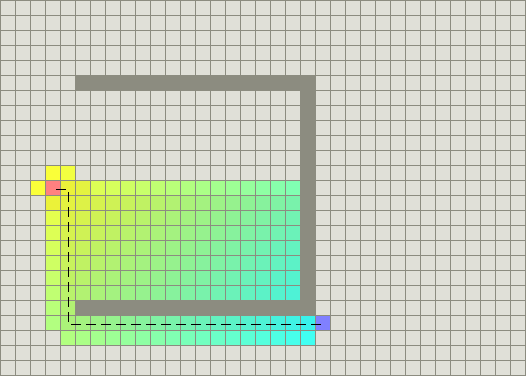
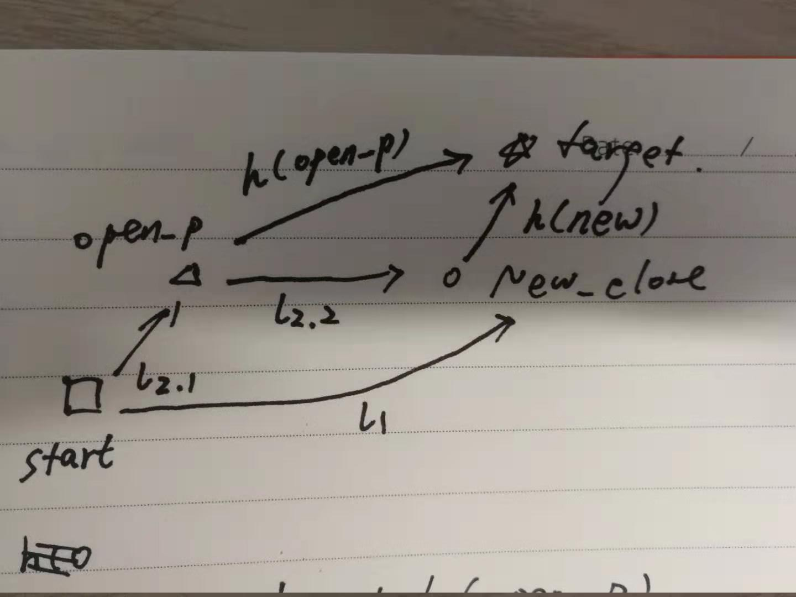
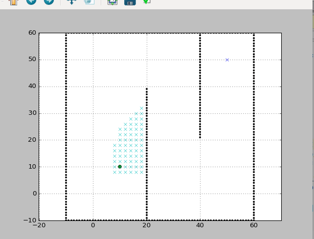

## A_Star路径规划方法
---
### 方法核心
   　　　　　  
　　Ａstar是目前机器人领域最常用的路径规划方法之一，比起之前的各种规划方法，其搜索过程中引入了启发式函数，保证了搜索的效率。  
　　Ａ*方法  
 - 输入：  
　　给定标明了障碍物、可行区域的地图  
　　给定起始点、终止点  
　　给定机器人碰撞半径  
　　给定运动基元（例如八方向运动、四方向运动等）  
 - 输出：  
　　一条从起始点出发、到达目标点的路径，由满足运动基元的相邻点组成  
---

### 算法流程
　　Ａstar的总算法流程如下：
 - 首先对输入的地图以机器人碰撞半径为半径的膨胀，保证找到的路径是安全的。
 - 新开辟两个空列表open_set与close_set，其中open_set中放置“调查中的嫌疑人”，而close_set中放置“结案的嫌疑人”。同时这两个列表中的元素是没有重复的的，因此这两个列表将整个空间中的点分为了三部分，即open_set中的点，close_set中的点，没有进入两个set的点。
 - 声明对open_set和close_set中的每一个点，我们都保存四个属性，即ｘ坐标，ｙ坐标，从起始点到该点当前发现的最小的代价，该点的父节点。
 - 声明搜索的原则为：如果一个点在open_set中，且其代价最小，则我们开始“调查”这个点，并将其“结案处理”（转移进close_set）
 - 声明“调查”的原则为：首先判断是否为目标点，如果是，直接“结案处理”（该点移入close_set）并结束搜索。如果不是，基于机器人运动基元，将被调查点的所有临域点遍历，如果临域点不在open_set中，将其放入open_set，如果临域点已经在open_set中，则比较从起始点出发，经由被调查点到该临域点的路径是否代价更小，如果更小，则更新该临域点的代价，并将该临域点的父亲节点修改为被调查点。在遍历完所有临域点后，对该节点做“结案处理”（移入close_set）。
 
 - 至此我们可以形象化的描述整个搜索过程：首先“调查”起始点，接着进行循环：在open_set中选择cost最小的点进行“调查”，直到搜索到达目标点，则宣布找到了最短路径。如果open_set中没有了点，说明没有了“待调查嫌疑人”，宣告无法破案，即找不到目标点。

---

### 方法特色
　　Ａstar可以取得巨大成功的原因在于两点，一是利用open_set和close_set两个列表帮助搜索，二是在搜索的代价评估中引入了启发式函数，优化了了搜索的方向。因此我们将主要分析这两点。  
　　Ａstar成功的第一个原因在于其开辟了两个列表进行帮助搜索。这两个列表其实隐含着一些非常重要的内在属性，open_set中的点的重要属性有：
 - 可达性，就是说open_set中所有的点都是可以从起始点到达的。这一属性是由于open_set是从close_set点按照运动基元递推得到的，保证了其是可以到达的。
 - 封闭性，就是说open_set与障碍物点组成了一个封闭面，将起始点包围在面内，这决定了下一步的所有可能搜索点一定需要从open_set中产生，保证了分辨率上的完备性。  
close_set中点的重要属性有：
 - 顺序性，就是说每一个点都指向其父节点，顺着父节点可以一直追溯到起始点，同时追溯的这条路径就是起始点到该点的最短路径。这是由open_set中点的不断cost更新得到的，每被从不同父节点遍历到一次，都会按照上文所述的方法进行cost和父节点的更新，使得其一旦进入close_set，父节点就是最短顺序意义下的上一个点。因此到达终点后只需要从终点开始一路追溯父节点就可以生成最短路径。
 - 最优性，这是对close_set中的每个点的cost来讲的，就是说每个点的cost都是起始点到该点的最小cost，这是一个非常重要的性质，保证了A*方法得到的路径是最优的，关于最优性的证明见下文。

　　Ａstar成功的另一个重要原因在于其应用了启发函数优化搜索方向，之前的搜索方法只是根据cost最短的点向外搜索，有点像“迷宫灌水”，从起点开始大水满灌，水同时像四面八方涌去，直到到达终点。但这种方法的效率不高，因为这种方法没有考虑到一个重要的先验知识是我们知道目标点的位置，这种方法却对这个巨大的先验知识不加利用，导致效率较为低下。与之前的一些方法不同，Ａ*注意到了这个宝贵的先验知识，相当于人工地利用“启发函数”将目标点方向的地势挖低，将原理目标点的地势升高，这样再进行“大水漫灌”的时候就会优先向目标点的方向灌去，优化了搜索方向，尤其是在与目标点之间再没有障碍物遮挡时，Ａ*方法会直接奔向目标点，节省了大量的搜索过程。  
　　Ａstar使用的估价函数写作f(x)=g(x)+h(x)，其中f(x)决定从open_set中选择哪个点进行调查，g(x)为每个点已知的从出发点开始到该点的最短cost，h(x)则是启发函数，有不同的启发式函数，但核心思想都是最理想情况下到达目标点的估计距离。但必须保证在衡量a,b两点距离时，h(a->b)一定要小于等于g(a->b)，这是选择启发函数的必要条件，否则选择的启发函数会导致Ａ*找到的不一定是最优路径（因为下面证明中“三角形两边之和大于第三边”的条件被打破了）。

---

### 最优性证明
　　因为Ａstar的路径实质是在close_set中首尾相连得到的，因此其实就是证明close_set中所有点的cost都是从起始点出发下最小的。  
　　首先说明close_set中所有的点都是从当前open_set中选择的f(p)=g(p)+h(p)中f最小的点，这是重要前提条件。  
　　其次说明所有的close_set点外层一定包裹着一层open_set的点，这是遍历搜索所决定的。  
　　基于以上说明,证明如下：  
　　记新选中的准备放入close_set的点为new_close，由astar方法搜索到的路径cost为l1,假设另有一条路径可以从出发点出发更短地到达该点，则可能有两种到达方式：  
　　１、从close_set中的某个点直接相邻到达。  
　　２、从start->open_set某点->(某/某些未搜索点，也许有)->new_close点  
　　首先，第一种到达方式显而易见是不存在的，因为close_set中所有的点的可到临域都经历过搜索，并更新过cost值，因此１这种情况必然是不存在的。  
　　其次，假设２这种情况存在，则如下图所示：  

　　有　f(open_p)=l2.1 + h(open_p)，因为启发函数是最理想的最短路径  
　　因此　h(open_p) <= l2.2 + h(new_close)　（这里可以类比三角形两边之和大于第三边）  
　　则有　f(open_p) <= l2.1 + l2.2 + h(new_close) = l2 + h(new_close)  
　　根据２的假设，l2小于l1：　  
　　则　f(open_p) <= l2 + h(new_close) < l1 + h(new_close) = f(new_close)  
　　因为f(new_close)是open_set中的最小值，因此open_p点不存在，证明结束。  

===

###　实验
Ａstar搜索的全过程：  
　　

