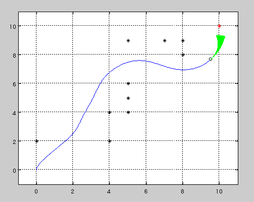
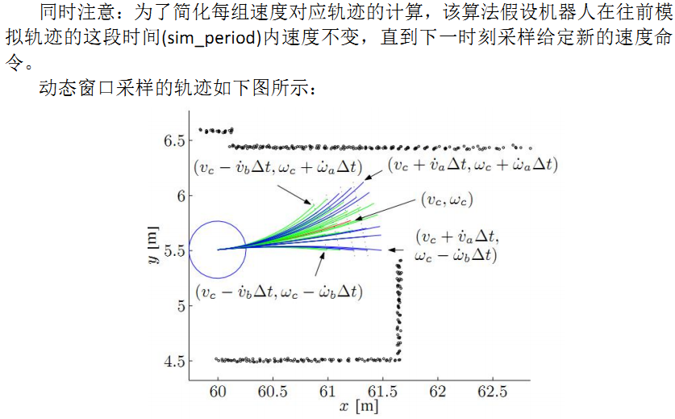
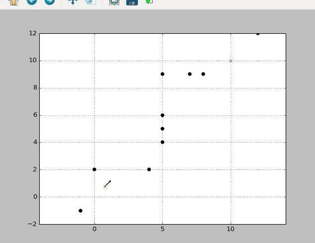
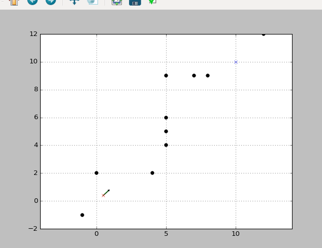
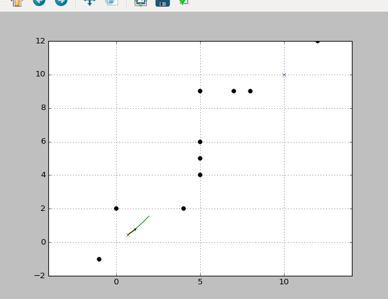

## 动态窗口法（Dynamic Window Approach,DWA)
　　　　　  
　　动态窗口法是轨迹规划里较为简单的方法，也是使用最为广泛的方法，因为被Ros作为了Movebase的默认方法，因此在实际机器人的应用中极为广泛，也是值得研究的一种方法。
---

### 定义阶段
　　定义状态 x:[x坐标，ｙ坐标，朝向角度，速度，角速度]五个量作为状态，并且在运行中动态更新这些状态，这些状态是进行规划的最主要依据。  
　　定义目标点goal:[ｘ坐标，ｙ坐标]，在计算到目标点的cost与计算是否到目标点时会用到。  
　　定义障碍物ob:[point1，point2, ...]由多个障碍点组成，每个障碍点用该点坐标表示。  
　　定义动作u，即小车的控制变量，常见的控制变量是[速度，角速度]。  
　　定义轨迹traj，即状态｛x1,x2,x3,...｝的集合，里面有多少个状态与下文中的估计时间和仿真间隔有关。  
　　定义规划参数config，决定了规划中会用到的一些常数，有：
 - 速度阈值：　最大值、最小值
 - 角速度阈值：　最大值、最小值
 - 加速度、角加速度的最大值
 - 速度分辨率、角速度分辨率：之后进行速度、角速度采样搜索时会用到
 - 仿真间隔dt：决定了仿真的时间精细程度。
 - 估计时间：将采样的速度、角速度进行多久的轨迹采集，类似于下象棋“向前看几步”
 - cost权值：进行轨迹评估时主要考虑三个方面：目标点代价、速度代价、障碍物代价。而cost权值就是声明如何每个代价的重要性。
 - 机器人半径：用于轨迹评估中的碰撞检测

---

### 搜索阶段
  
　　动态窗口法的本质是对所有可行的输出按照一定的分辨率进行采样遍历，并去计算每一个输出在运行一定时间之后轨迹，再利用轨迹打分函数对每个轨迹进行打分，最后输出得分最高的轨迹对应的输出[速度，角速度]  
　　因此其实轨迹只是一个中间结果，是对当前动作的外推，只是用来进行动作评判的。所以简单的想，整个DWA方法只不过是在循环地做这样一件事情:
 - 获得v_min,v_max,w_min,w_max
 - 采样得到　(v_min,w_min),(v_min+dv,w_min),...(v_min+dv,w_min+dw)...(v_max,w_max)这些可能的输出对
 - 将上述输出对分别作为动作u,在当前的状态x的基础上进行外推，获得预计的轨迹对traj1,traj2,traj3,...,trajn
 - 利用一个打分函数，对上述轨迹们分别进行代价评估，得到cost1,cost2,cost3,...,costn
 - 选择代价最低的输出，并作为当前输出让机器人执行，更新状态并回到第一步

---

### 评估函数
　　通过搜索阶段可以看出，其实问题的关键又转移到了如何找到一个行之有效的评估函数。  
　　首先需要明确评估函数是这样一个映射：cost = f(traj)，输入为由预估状态对{x1,x2,....,xn}组成的轨迹，输出为这个轨迹对应的代价。  
　　其实评估函数可以根据不同场景进行设置，比较常见的评估函数主要由三种代价组成，即目标点代价、速度代价、障碍物代价。  
 - 目标点代价：
　　目标点代价(goal_cost)的一种常见定义为：对轨迹的最后一个状态xn进行分析，计算轨迹最后一个状态时，机器人的朝向与目标点角度的差距，差距越大，代价越大。
 - 速度代价：
　　速度代价(speed_cost)的一种常见定义为：对轨迹的最后一个状态xn进行分析，计算轨迹最后一个状态时，机器人的速度与最大速度的差距，差距越大，代价越大。
 - 障碍物代价：
　　障碍物代价(ob_cost)的一种常见定义为：对整个轨迹进行分析，找到整个轨迹中距离障碍物最近瞬间，并将此距离的倒数作为代价返回。如果发生碰撞，则返回正无穷，显然这条轨迹则不能被选取。

　　最后将三种代价加权相加，即final_cost = gain1*to_goal_cost + gain2*speed_cost + gain3*ob_cost，作为总的代价返回。

---

### 实验测试
　　由上述分析可以看出，向后估计多少步是本算法关键的一个参数，因为DWA并不是像动态规划或强化学习一样，传统DWA对未来的估计没有任何智能，只是将当前的动作原封不动的应用于之后的每一个状态，因此可以想见，如果向后外推步数过少，则不能看到未来的危险，动作会过于激进;但如果向后外推步数过多，则会看到并不会遇到的危险，导致畏手畏脚。因此本实验通过变动不同的外推步数来观察得到的轨迹。  
 - 外推3步：
  
 - 外推10步：
  
 - 外推30步：
  

