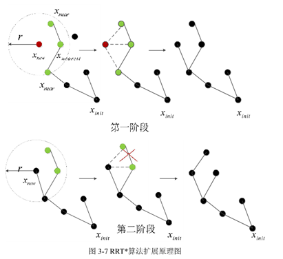
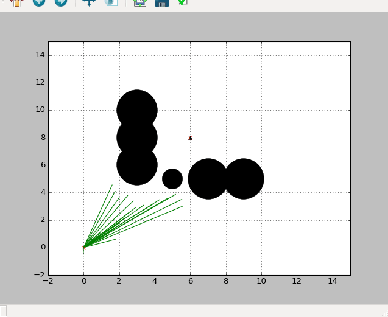

## 简介
　　RRT_star算法是RRT方法的一个变种，事实上，RRT\_star是采样方法对搜索方法的一种妥协。RRT方法是纯粹的采样方法，因此通常无法保证路径的最优性，获得的路径有时会难以理解的弯曲，这是因为采样的运气实在太差了。在实际应用中，我们往往不能忍受这么差的路径，因此我们希望可以有一种方法折衷RRT方法的速度与基于搜索的方法的最优性，RRT\_star方法就这样横空出世了。

## 方法
　　RRT_star方法与传统RRT方法相比的核心差别主要在于其扩展结点时的方法，传统RRT直接通过采样，获得一个半随机引导点，然后从当前最靠近该引导点的结点伸出一只“触手”，并不断重复这一步骤直到“触手”触摸到目标点。而可以看出，这其中非常讨厌的一点在于，也许随机生成的引导点会将“触手”待外，或者后来新生的结点更适合作为老结点的爸爸，这些我们期望的改进都是传统RRT方法的弊端。换爸爸的操作如下：  
　　　　  
　　算法步骤：  
 - １初始化，将起始点压入结点队列。
 - ２for i in range(最大搜索轮次)：
 - ３　　随机获取引导点rnd
 - ４　　从当前距离rnd最近的结点向rnd伸出“触手”new_node
 - ５　　if new_node　通过碰撞检测：
 - ６　　　　获取new_node附近d距离内的所有结点nearinds
 - ７　　　　根据每个结点的当前cost+dist(new_node)作为每个结点的“父亲力”
 - ８　　　　选择“父亲力”最大的结点作为当前结点new_node的爸爸，并将上步的父亲力作为当前结点的cost
 - ９　　返回循环２直到到达最大搜索轮次
 - １０if 到达目标点:
 - １１　　返回路径

　　从上述步骤可以看出，RRT_star其实更像Dijkstra方法，因为其只有一个g函数而没有h函数（不排除有魔改版的RRT\_star有h函数），并且需要与传统RRT进行比较的一点是，RRT\_star是可以保证渐进最优的，也就是说当最大搜索轮次设的足够大时，其可以到达全局最优。当然，由于其随机搜索的特性，通常来讲其到达全局最优的速度是要远远慢于A\_star的，但这种方法的好处在于通常我们并不在意“最优”，而是不要过差就可以，因此RRT\_star方法可以通过设置最大搜索轮次的方法来设置搜索到多优为止，这是可以统筹机器性能的，是RRT\_star最大的优势。

## 实验
  

