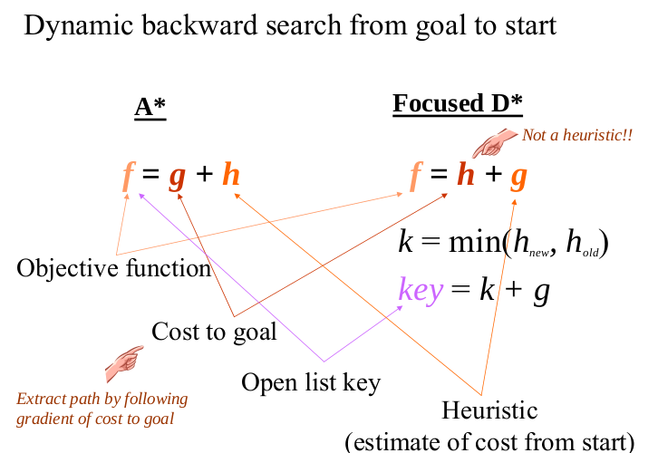
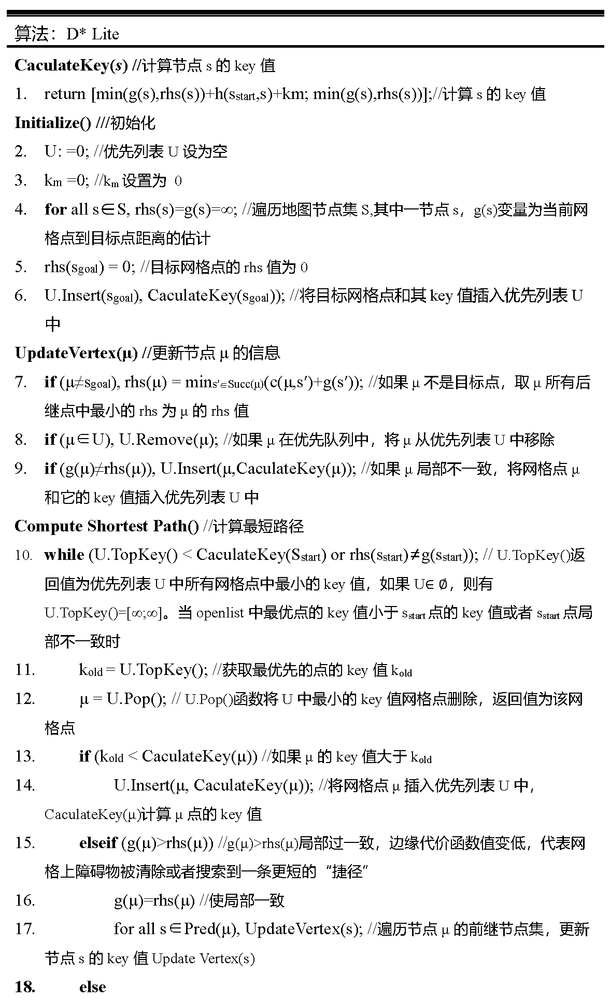
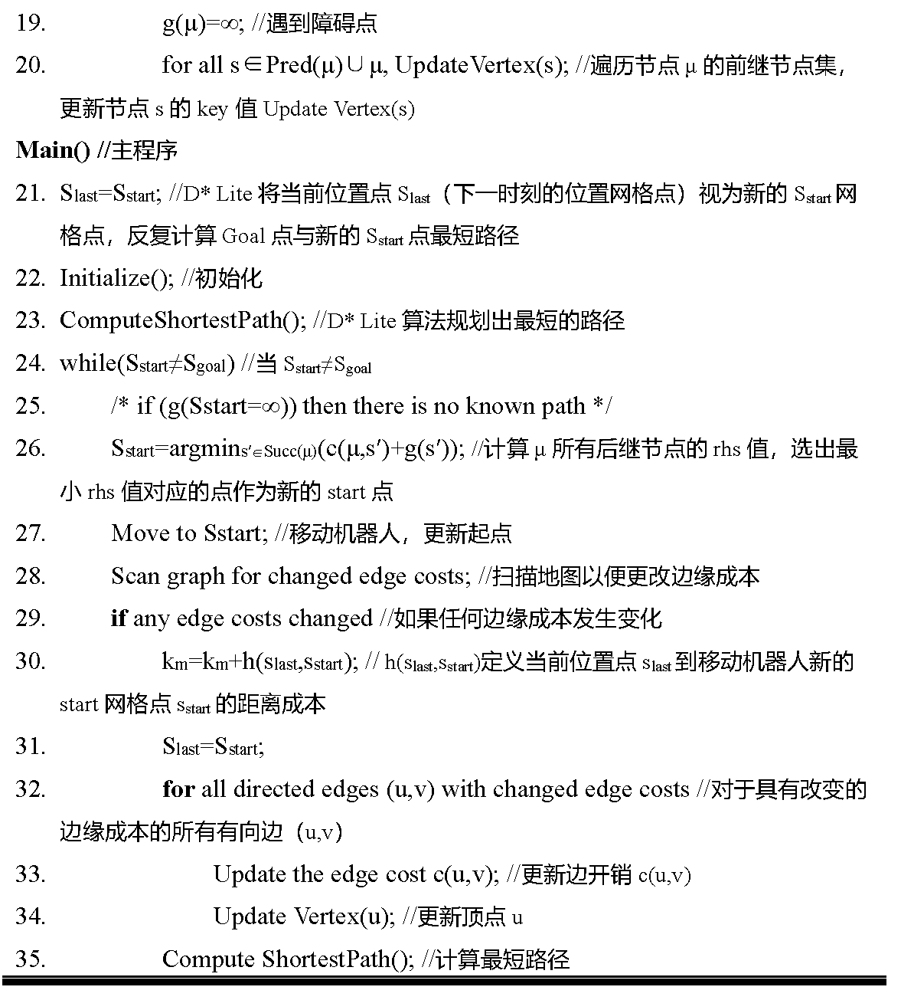
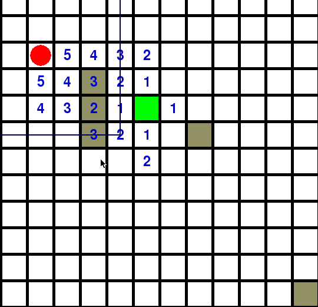

## １简介
　　Ｄ_star_lite是Dynamic A*的简化版，剔除了原D*的一些不必要的操作，形成了现有的D_lite。显而易见，名字中就带有Dynamic，本算法是专门针对动态障碍物环境的。传统的A*假设障碍物不发生变动，规划出一条静态的路径，并一直执行这条路径。但在现实环境中，这种假设是不成立的。主要有两点原因，一是机器人的观测野有限，通常不能从出发点就看到目标点，导致在行进的途中，有一些障碍物被不断的发现并加入地图中。二是地图中也许存在动态障碍物，这就要求路径规划算法要有足够的应对动态障碍物的能力。  
　　传统的A*如果面对动态障碍物，一个最简单的思路就是每发现地图发生了一次变动，就对全图做一次A*。这样确实可以保证最优，也能保证安全，但效率太低下，在地图较大时速度不能实时。我们发现，即使仅仅变化了几个孤立的障碍物点，A*就需要把整个地图全部更新一遍，实在是太低效了，于是考虑能否对A*进行魔改，使其满足只需要重新计算局部的修改点附近的点就可以得到一条新的安全路径。这就是D_lite算法被提出的动力来源。  
　　如果要实现前述的说法，我们需要考虑怎样改动能使得不用计算所有的点：首先，如果运动过程中，当前点->目标点这条路径附近突然出现了障碍物，则容易想到，当前点->障碍物这一段路径中的点的代价将被影响较大，而障碍物->目标点这一段路径的代价则不受影响，因此D_lite的第一个改进就是把A*的搜索顺序反过来，从目标点开始搜索，直到搜到机器人当前点作为结束。也就是说传统A*中的g(s)函数衡量了从出发点到被搜索点s的最优距离，而在D_lite中我们用其表示被搜索点s到目标点的最优距离。而启发函数h(s)变为了被搜索点s到机器人起始点的距离。差别如下图所示：  
　　　　  
　　同时，注意到在D_lite运行的过程中，机器人的当前位置是在移动的，因此h(s)不能单纯以机器人的起始位置作为衡量，还需要根据每一步机器人的移动，加入k_modify做修正，这一项就是key值中km项的来历。同时容易看出，km值是在随着机器人的移动而变动的。同时D_lite中对每一个节点都维护了两个值和一个评判值，两个值分别为rhs和g值，他们都是为了描述当前节点距离目标点的距离，但是rhs值更新的比较及时，g值更新的比较缓慢，当地图不发生变动时，两个值通常是相等的，一旦某点发生变动，首先其与其周围点的rhs值发生变动，导致这些点成为“不平衡点”，我们通过一个优先队列去关注那些分数较低的点，并对他们进行更新和平衡化，直到机器人当前点的分数最低，我们宣布找到了一条最优路径。  
　　与A*不同，D_lite中不但要记录每一个节点的父节点，同时还要记录节点的每一个子节点，这是为了在该节点发生状态变动时，及时地将周围的所有节点进行更新。这里我们记Succ(s)为s的所有子节点，记Pred(s)为s的父节点，A*的搜索过程是一路生儿子生到目标点，而D_lite的搜索则是一路找爸爸找到起始点。下面我们用5个步骤程式化的描述D_lite的工作过程：  
 - １ 初始化所有节点，将目标点的rhs值设为0
 - ２ 进行优先搜索直到Sstart点平衡且其打分最小，则得到一条最优路径
 - ３ 将机器人沿规划出的最优路径前进一步
 - ４ 如果任何边（即两相邻节点的移动代价，因为突显障碍物或障碍物突然消失发生改变）发生了变动：  
　　　　　　a.更新启发函数h  
　　　　　　b.更新导致边变动的节点  
 - ５ 重复步骤２
　　事实上，上述的工作过程是经过压缩简化的，更具体的步骤如下图：  
　　　　
　　　　

---

## ２示例
　　Ｄ_lite由于其动态特性，一个简单的示例往往也需要数十张图片的描述，[这里](./Pictures/AppH-astar-dstar\_howie.pdf)是CMU的一个讲稿，其中对D\_lite有一个非常详细的示例。  
　　同时MIT对D_lite也有一个非常优秀的公开课，在[这里](https://www.youtube.com/watch?v=\_4u9W1xOuts)

---

## ３实验
红点为机器人当前位置，透明灰色障碍物为存在但未观测到的障碍物，黑色障碍物为已观测到的障碍物。  

